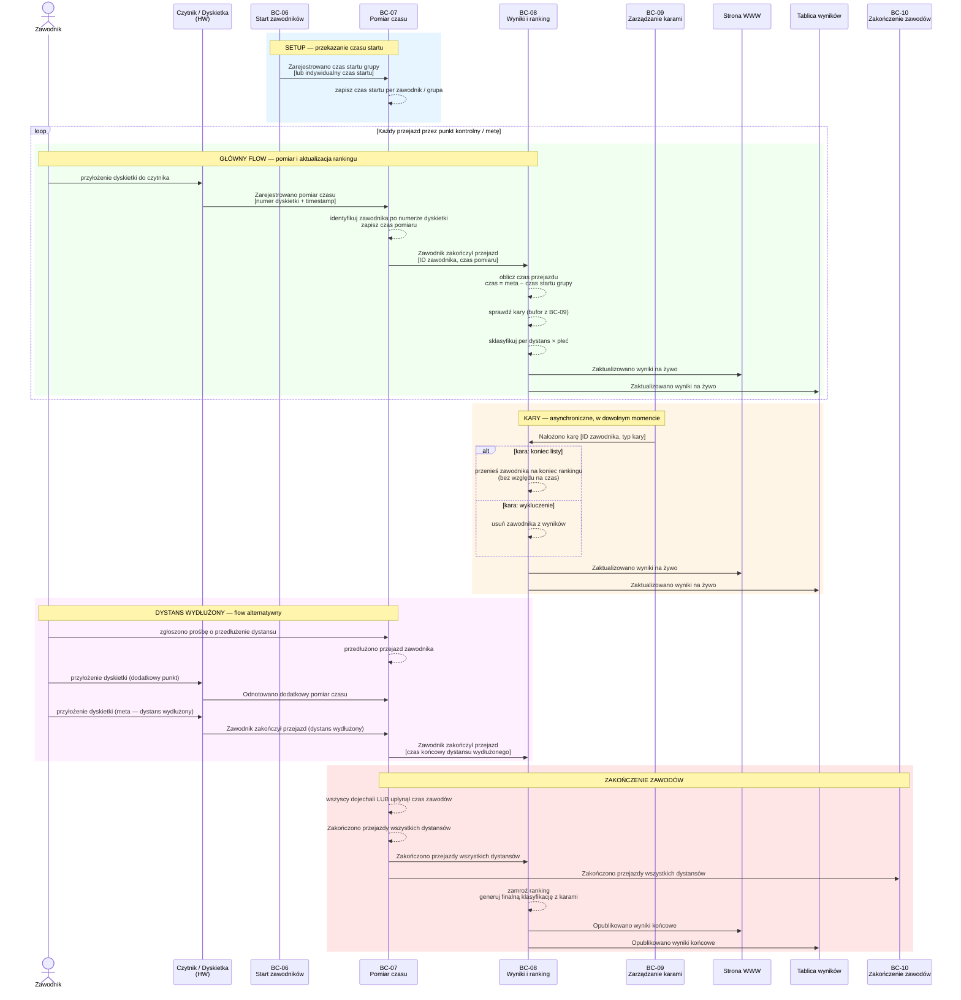

# Diagram sekwencji — Core Domain
## BC-07 Pomiar czasu + BC-08 Wyniki i ranking

```mermaid
sequenceDiagram
    actor Zawodnik
    participant Czytnik as Czytnik / Dyskietka<br/>(HW)
    participant BC06 as BC-06<br/>Start zawodników
    participant BC07 as BC-07<br/>Pomiar czasu
    participant BC08 as BC-08<br/>Wyniki i ranking
    participant BC09 as BC-09<br/>Zarządzanie karami
    participant WWW as Strona WWW
    participant Tablica as Tablica wyników
    participant BC10 as BC-10<br/>Zakończenie zawodów

    rect rgb(230, 245, 255)
        Note over BC06, BC07: SETUP — przekazanie czasu startu
        BC06 ->> BC07: Zarejestrowano czas startu grupy<br/>[lub indywidualny czas startu]
        BC07 -->> BC07: zapisz czas startu per zawodnik / grupa
    end

    loop Każdy przejazd przez punkt kontrolny / metę
        rect rgb(240, 255, 240)
            Note over Zawodnik, BC08: GŁÓWNY FLOW — pomiar i aktualizacja rankingu
            Zawodnik ->> Czytnik: przyłożenie dyskietki do czytnika
            Czytnik ->> BC07: Zarejestrowano pomiar czasu<br/>[numer dyskietki + timestamp]
            BC07 -->> BC07: identyfikuj zawodnika po numerze dyskietki<br/>zapisz czas pomiaru
            BC07 ->> BC08: Zawodnik zakończył przejazd<br/>[ID zawodnika, czas pomiaru]
            BC08 -->> BC08: oblicz czas przejazdu<br/>czas = meta − czas startu grupy
            BC08 -->> BC08: sprawdź kary (bufor z BC-09)
            BC08 -->> BC08: sklasyfikuj per dystans × płeć
            BC08 ->> WWW: Zaktualizowano wyniki na żywo
            BC08 ->> Tablica: Zaktualizowano wyniki na żywo
        end
    end

    rect rgb(255, 245, 230)
        Note over BC09, BC08: KARY — asynchroniczne, w dowolnym momencie
        BC09 ->> BC08: Nałożono karę [ID zawodnika, typ kary]
        alt kara: koniec listy
            BC08 -->> BC08: przenieś zawodnika na koniec rankingu<br/>(bez względu na czas)
        else kara: wykluczenie
            BC08 -->> BC08: usuń zawodnika z wyników
        end
        BC08 ->> WWW: Zaktualizowano wyniki na żywo
        BC08 ->> Tablica: Zaktualizowano wyniki na żywo
    end

    rect rgb(255, 240, 255)
        Note over Zawodnik, BC07: DYSTANS WYDŁUŻONY — flow alternatywny
        Zawodnik ->> BC07: zgłoszono prośbę o przedłużenie dystansu
        BC07 -->> BC07: przedłużono przejazd zawodnika
        Zawodnik ->> Czytnik: przyłożenie dyskietki (dodatkowy punkt)
        Czytnik ->> BC07: Odnotowano dodatkowy pomiar czasu
        Zawodnik ->> Czytnik: przyłożenie dyskietki (meta — dystans wydłużony)
        Czytnik ->> BC07: Zawodnik zakończył przejazd (dystans wydłużony)
        BC07 ->> BC08: Zawodnik zakończył przejazd<br/>[czas końcowy dystansu wydłużonego]
    end

    rect rgb(255, 230, 230)
        Note over BC07, BC10: ZAKOŃCZENIE ZAWODÓW
        BC07 -->> BC07: wszyscy dojechali LUB upłynął czas zawodów
        BC07 -->> BC07: Zakończono przejazdy wszystkich dystansów
        BC07 ->> BC08: Zakończono przejazdy wszystkich dystansów
        BC07 ->> BC10: Zakończono przejazdy wszystkich dystansów
        BC08 -->> BC08: zamroź ranking<br/>generuj finalną klasyfikację z karami
        BC08 ->> WWW: Opublikowano wyniki końcowe
        BC08 ->> Tablica: Opublikowano wyniki końcowe
    end
```
