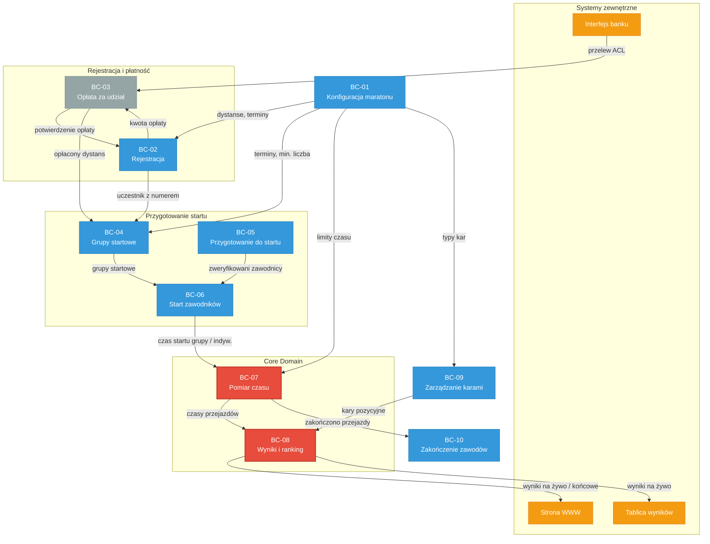

# Context Map — System zarządzania i pomiaru czasu na maratonie rowerowym 24H

```mermaid
graph TD
    subgraph EXT["Systemy zewnętrzne"]
        BANK["Interfejs banku"]
        WWW["Strona WWW"]
        TABLICA["Tablica wyników"]
    end

    subgraph CORE["Core Domain"]
        BC07["BC-07\nPomiar czasu"]
        BC08["BC-08\nWyniki i ranking"]
    end

    BC01["BC-01\nKonfiguracja maratonu"]

    subgraph PREREJESTRACJA["Rejestracja i płatność"]
        BC02["BC-02\nRejestracja"]
        BC03["BC-03\nOpłata za udział"]
    end

    subgraph STARTFLOW["Przygotowanie startu"]
        BC04["BC-04\nGrupy startowe"]
        BC05["BC-05\nPrzygotowanie do startu"]
        BC06["BC-06\nStart zawodników"]
    end

    BC09["BC-09\nZarządzanie karami"]
    BC10["BC-10\nZakończenie zawodów"]

    %% Konfiguracja → wszystkich
    BC01 -->|"dystanse, terminy"| BC02
    BC01 -->|"terminy, min. liczba"| BC04
    BC01 -->|"limity czasu"| BC07
    BC01 -->|"typy kar"| BC09

    %% Rejestracja ↔ Opłata
    BC02 -->|"kwota opłaty"| BC03
    BC03 -->|"potwierdzenie opłaty"| BC02
    BC03 -->|"opłacony dystans"| BC04
    BC02 -->|"uczestnik z numerem"| BC04

    %% Bank → Opłata
    BANK -->|"przelew ACL"| BC03

    %% Flow startowy
    BC04 -->|"grupy startowe"| BC06
    BC05 -->|"zweryfikowani zawodnicy"| BC06
    BC06 -->|"czas startu grupy / indyw."| BC07

    %% Core flow
    BC07 -->|"czasy przejazdów"| BC08
    BC09 -->|"kary pozycyjne"| BC08

    %% Publikacja wyników
    BC08 -->|"wyniki na żywo / końcowe"| WWW
    BC08 -->|"wyniki na żywo"| TABLICA

    %% Zakończenie
    BC07 -->|"zakończono przejazdy"| BC10

    %% Style
    classDef core fill:#e74c3c,color:#fff,stroke:#c0392b,stroke-width:2px
    classDef supporting fill:#3498db,color:#fff,stroke:#2980b9
    classDef generic fill:#95a5a6,color:#fff,stroke:#7f8c8d
    classDef external fill:#f39c12,color:#fff,stroke:#e67e22

    class BC07,BC08 core
    class BC01,BC02,BC04,BC05,BC06,BC09,BC10 supporting
    class BC03 generic
    class BANK,WWW,TABLICA external
```
