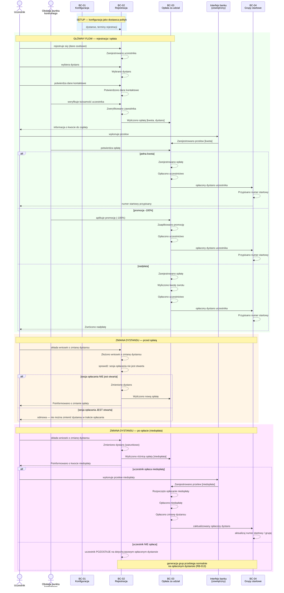

# Diagram sekwencji — Rejestracja i Opłata za udział
## BC-02 Rejestracja + BC-03 Opłata za udział

```mermaid
sequenceDiagram
    actor Uczestnik
    actor Obsługa as Obsługa punktu<br/>kontrolnego
    participant BC01 as BC-01<br/>Konfiguracja
    participant BC02 as BC-02<br/>Rejestracja
    participant BC03 as BC-03<br/>Opłata za udział
    participant BANK as Interfejs banku<br/>(zewnętrzny)
    participant BC04 as BC-04<br/>Grupy startowe

    rect rgb(230, 245, 255)
        Note over BC01, BC02: SETUP — konfiguracja jako dostawca polityk
        BC01 -->> BC02: dystanse, terminy rejestracji
    end

    rect rgb(240, 255, 240)
        Note over Uczestnik, BC03: GŁÓWNY FLOW — rejestracja i opłata
        Uczestnik ->> BC02: rejestruje się (dane osobowe)
        BC02 -->> BC02: Zarejestrowano uczestnika
        Uczestnik ->> BC02: wybiera dystans
        BC02 -->> BC02: Wybrano dystans
        Uczestnik ->> BC02: potwierdza dane kontaktowe
        BC02 -->> BC02: Potwierdzono dane kontaktowe
        Obsługa ->> BC02: weryfikuje tożsamość uczestnika
        BC02 -->> BC02: Zweryfikowano zawodnika
        BC02 ->> BC03: Wyliczono opłatę [kwota, dystans]
        BC02 -->> Uczestnik: informacja o kwocie do zapłaty

        Uczestnik ->> BANK: wykonuje przelew
        BANK ->> BC03: Zarejestrowano przelew [kwota]
        Obsługa ->> BC03: potwierdza opłatę

        alt pełna kwota
            BC03 -->> BC03: Zarejestrowano opłatę
            BC03 -->> BC03: Opłacono uczestnictwo
            BC03 ->> BC04: opłacony dystans uczestnika
            BC04 -->> BC04: Przypisano numer startowy
            BC04 -->> Uczestnik: numer startowy przypisany

        else promocja -100%
            Obsługa ->> BC03: aplikuje promocję (-100%)
            BC03 -->> BC03: Zaaplikowano promocję
            BC03 -->> BC03: Opłacono uczestnictwo
            BC03 ->> BC04: opłacony dystans uczestnika
            BC04 -->> BC04: Przypisano numer startowy

        else nadpłata
            BC03 -->> BC03: Zarejestrowano opłatę
            BC03 -->> BC03: Wyliczono kwotę zwrotu
            BC03 -->> BC03: Opłacono uczestnictwo
            BC03 ->> BC04: opłacony dystans uczestnika
            BC04 -->> BC04: Przypisano numer startowy
            BC03 -->> Uczestnik: Zwrócono nadpłatę
        end
    end

    rect rgb(255, 245, 230)
        Note over Uczestnik, BC04: ZMIANA DYSTANSU — przed opłatą
        Uczestnik ->> BC02: składa wniosek o zmianę dystansu
        BC02 -->> BC02: Złożono wniosek o zmianę dystansu
        BC02 -->> BC02: sprawdź: sesja opłacania nie jest otwarta

        alt sesja opłacania NIE jest otwarta
            BC02 -->> BC02: Zmieniono dystans
            BC02 ->> BC03: Wyliczono nową opłatę
            BC02 -->> Uczestnik: Poinformowano o zmianie opłaty
        else sesja opłacania JEST otwarta
            BC02 -->> Uczestnik: odmowa — nie można zmienić dystansu w trakcie opłacania
        end
    end

    rect rgb(255, 230, 255)
        Note over Uczestnik, BC04: ZMIANA DYSTANSU — po opłacie (niedopłata)
        Uczestnik ->> BC02: składa wniosek o zmianę dystansu
        BC02 -->> BC02: Zmieniono dystans (warunkowo)
        BC02 ->> BC03: Wyliczono różnicę opłaty [niedopłata]
        BC02 -->> Uczestnik: Poinformowano o kwocie niedopłaty

        alt uczestnik opłaca niedopłatę
            Uczestnik ->> BANK: wykonuje przelew niedopłaty
            BANK ->> BC03: Zarejestrowano przelew [niedopłata]
            BC03 -->> BC03: Rozpoczęto opłacanie niedopłaty
            BC03 -->> BC03: Opłacono niedopłatę
            BC03 -->> BC03: Opłacono zmianę dystansu
            BC03 ->> BC04: zaktualizowany opłacony dystans
            BC04 -->> BC04: aktualizuj numer startowy / grupę

        else uczestnik NIE opłaca
            BC02 -->> BC02: uczestnik POZOSTAJE na dotychczasowym opłaconym dystansie
            Note over BC02, BC04: generacja grup przebiega normalnie<br/>na opłaconym dystansie (RB-013)
        end
    end
```
